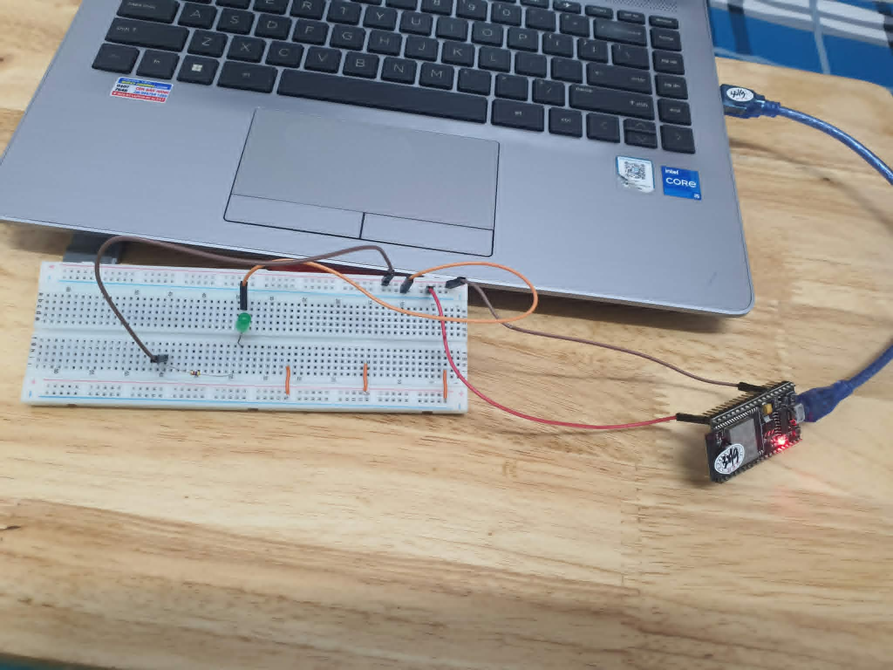

# Daily Learning Log — 2026-09-30

## 🎯 Goal

> What was I trying to learn or understand today?

*Learned what is RTOS, FreeTOS, install ESP-IDF extension on VScode and got the program working, learned how to build, flash and monitor an esp32.

## 🔨 Implementation

> What did I actually build, change, or experiment with?

*I changed the code the course gave and added a blink_led function according to the challange

## 🧠 What I Learned

> What concepts finally clicked today?

* **RTOS:**
  A OS that place importance on time and task management. With time splicing/management, it perform more task with less core, FreeTOS is RTOS for esp32 with added API for convenience.

* **Minor concepts:**
  How to create a task, how to delay, how to declare, set GPIO pins.

## 📟 Results

> What happened when I ran it? Include serial output, measurements, or hardware behavior.

*A basic circuit that blinks an led every 500ms.

## 🐛 Gotchas

> Bugs, mistakes, unexpected behavior, and how I figured them out.

## ❓ Things I Still Don't Understand

> Questions or concepts I couldn't fully explain yet.

## 🔗 References

